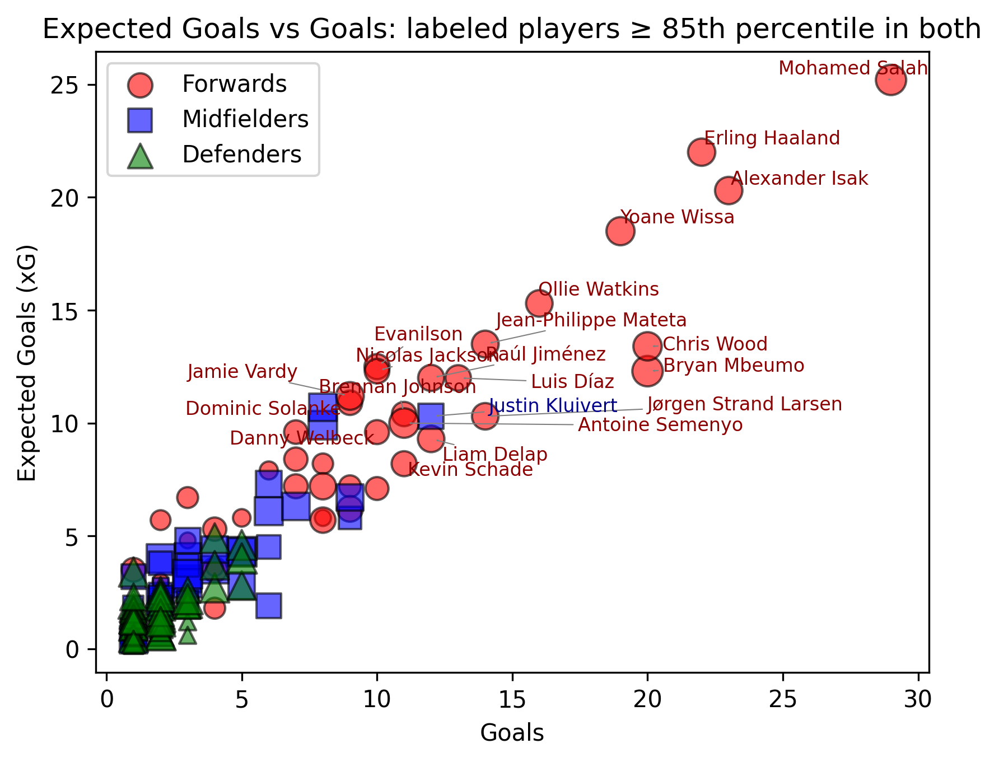
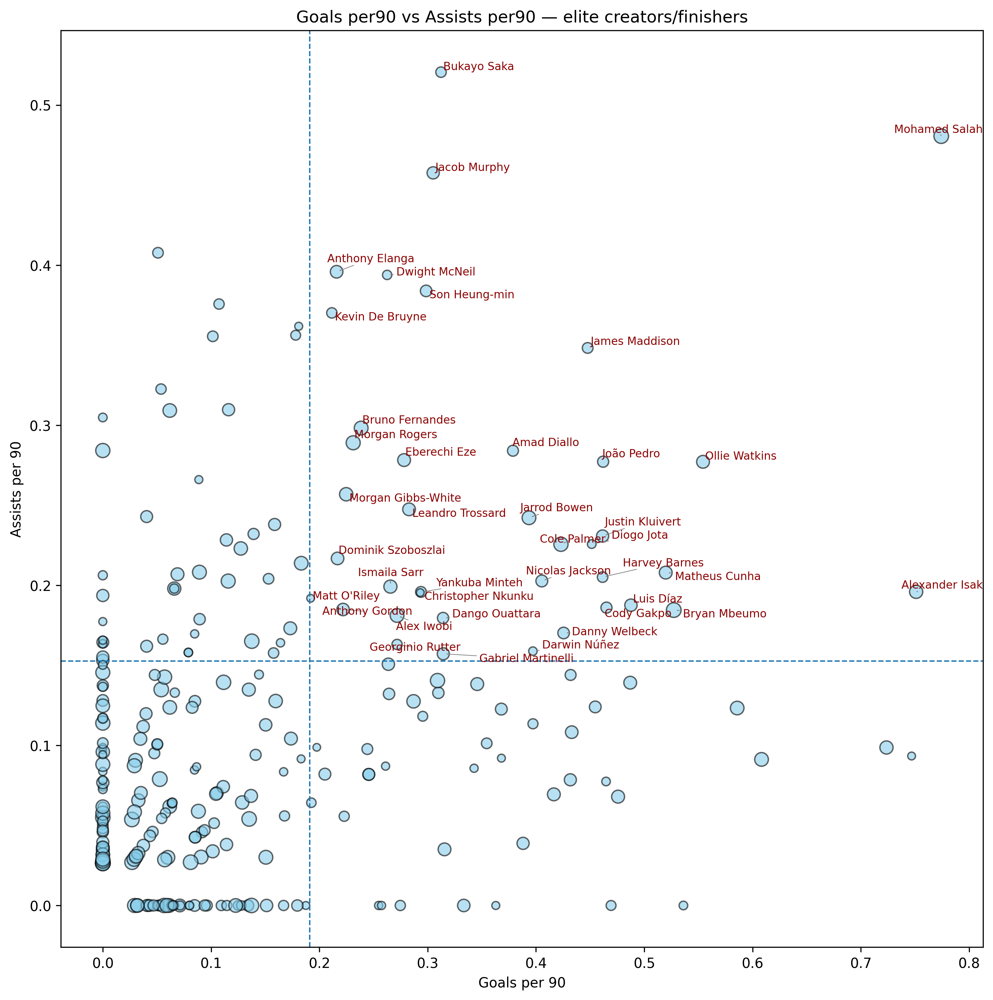
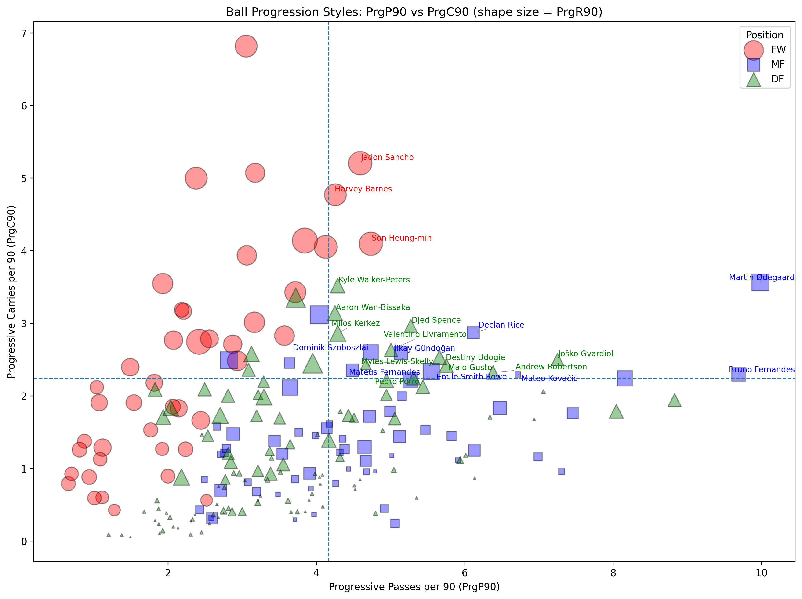
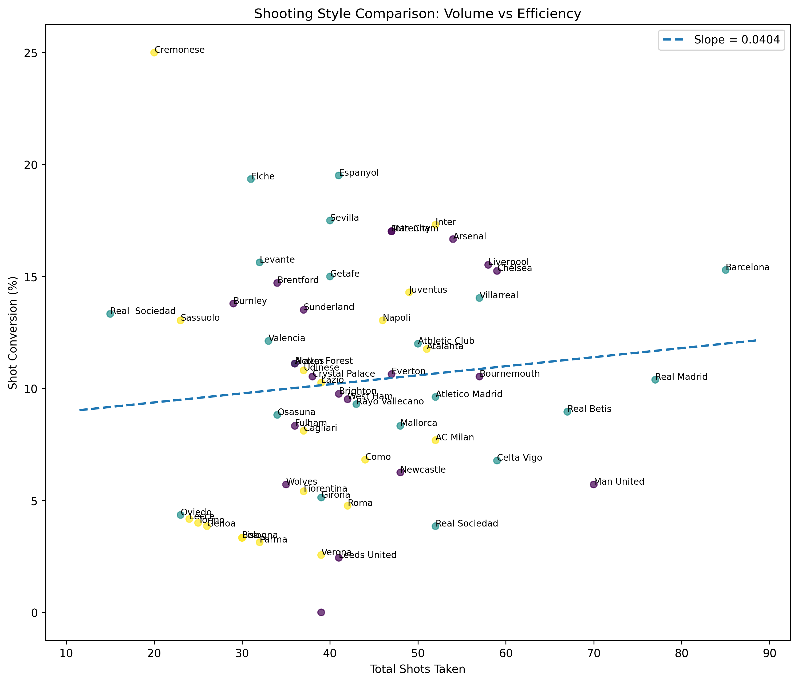

# EPL Player Skill Map (Python + SQL)
Identify elite players with “top-right” scatter plots (e.g., npxG/90 vs xA/90).
**Tech:** Python (pandas, matplotlib), SQL (SQLite), Jupyter.

## Structure
- `data/` https://www.kaggle.com/datasets/siddhrajthakor/fbref-premier-league-202425-player-stats-dataset
https://www.kaggle.com/datasets/mohulaprasath/daily-football-stats-202526-epl-laligaserie-a
- `figures/` exported plots
- `notebooks/` analysis notebooks
- `requirements.txt` Python deps

## Reproduce
```bash
pip install -r requirements.txt
# open notebooks/01_explore.ipynb and run
```

## Results

### Goals vs Expected Goals

Players in the top right are ones who get into high xG situations and are able to convert.

### Goals/90 vs Assists/90
 
Players in the top-right quadrant contribute both goals and assists at elite per-90 rates, highlighting balanced attackers.

### Progressive Passers vs Progressive Carriers

Players in the top right are ones who in the top 70 percentile for both progressive carries and passes per 90. The bigger their icon, the more progressive receives they get per 90. 

### Volume vs Efficiency of Shots

Top most efficient teams (goals per shot) identified using SQL.
  Top-right: high volume + efficient (dominant attacking teams).
  Top-left: low volume but efficient (clinical but low output).
  Bottom-right: high volume but wasteful (inefficient shooters).
  Bottom-left: low volume + low efficiency (weak attack).


## Progress

-**2025-9-18**
  - Set up DuckDB and created `matches` table from Kaggle dataset.
  - Built SQL query: team shooting efficiency (goals per shot).
  - Created scatterplot of Total Shots vs Shot Conversion % with top teams labeled.
  - Added regression line overlay to test correlation between volume and efficiency.

- **2025-09-13**
  - Created per-90 metrics (Goals90, Ast90, xG90).
  - Built scatterplot of Goals/90 vs Assists/90 with elite player labeling.
  - Installed scikit-learn for regression experiments.
  - Added Progressive Passes vs Progressive Carries scatter to explore ball progression styles.
  - Extended to 3-way progression analysis (PrgP90, PrgC90, PrgR90) using bubble plots.

- **2025-09-12**  
  - Filtered dataset to remove players with 0 goals/assists.  
  - Added elite scatter plots for FW/MF/DF using 75th percentile thresholds.  

- **2025-09-11**  
  - Set up GitHub repo with VS Code and pushed first commits.  
  - Installed Python, pandas, matplotlib, and adjustText.  
  - Loaded FBref dataset and made first scatterplot (Goals vs xG). 